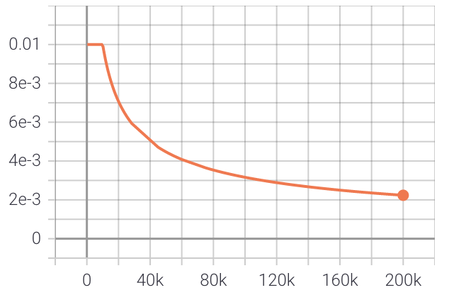
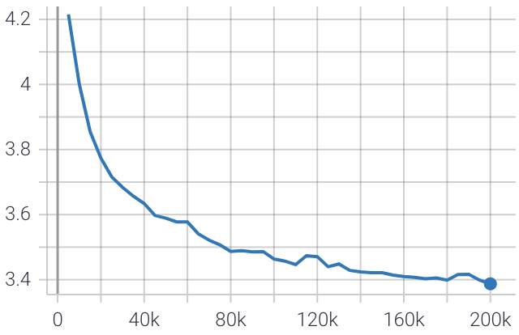
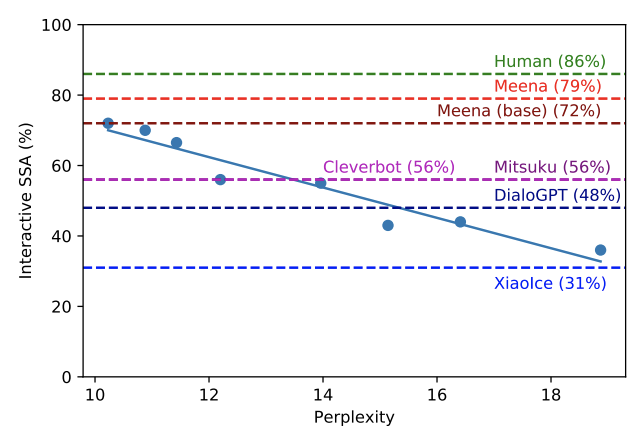

# Meena chatbot
Here's my attempt at recreating Meena, a state of the art chatbot developed by Google Research and described in the paper [Towards a Human-like Open-Domain Chatbot](https://arxiv.org/pdf/2001.09977.pdf).

For this implementation I used the tensor2tensor deep learning library, using an evolved transformer model as described in the paper.

The training set used is the [OpenSubtitles](https://opus.nlpl.eu/OpenSubtitles-v2018.php) corpus in the Italian language. Many other languages are available [here](https://opus.nlpl.eu/OpenSubtitles-v2018.php).

### Model
Similarly to the work done in the paper, this model consists of 1 encoder block and 12 decoder blocks for a total of 108M parameters. The optimizer used is Adafactor with the same training rate schedule as described in the paper.

## Training
Here are the results after training the model on 40M sentences of the OpenSubtitles dataset in the italian language.
The learning rate starts at 0.01 and remains constant for 10k steps then decay with the inverse square root of the number of steps.

Here's the plot of the evaluation loss during training.

The final **perplexity score is 10.4** which is very close to the perplexity score achieved by Google's meena chatbot 10.2. 

The paper shows a correlation between perplexity score and the Sensibleness and
Specificity Average which is correlated with the "human likeness" of the chatbot. Our perplexity score shows that our bot is better than other chatbots such as Cleverbot and DialoGPT:

The dataset used however does not represent well normal conversations between humans. However Opensubtitles provide very large datasets in many languages.

## Run pretrained model
Download the following model and extract it. Set proper MODEL_DIR and CHECKPOINT_NAME in `predict.py` and run `main.py`

- [Italian, 108M parameters, 200k steps, 40M sentences](https://mega.nz/file/cjZSmLgC#lvZW9g0v4sa6QN4-fVLaUVTLcD6GCjmFMI7_b762pqQ)

## Train a new model
For training simply run the ipython notebook on Google Colab, the model will be saved on Google Drive. At the end of the execution you can interact with the chatbot.

## Export the model
The model can be exported by copying the following files in a folder:
- hparams.json
- The trained model checkpoint
- The vocabulary .subwords file 

and run `main.py` after setting the proper model directory.

## Serving
`server.py` provides a simple HTTP API for serving the chatbot.